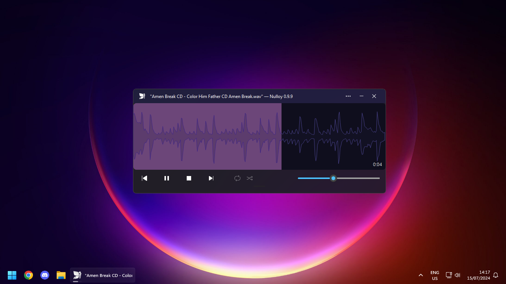

# nulloy-fluent-design
This repository hosts the `Fluent (Mica)` theme for Nulloy, which serves to simulate Windows 11's Fluent Design with Nulloy's Qt-based interface.

In order to download it, head over to the [Releases](https://github.com/ascpixi/nulloy-fluent-design/releases), and drop the `nzs` file into the `Skins` directory of your Nulloy installation - for example, `C:\Program Files (x86)\Nulloy\Skins`.

The skin is based on the **Metro** skin, pre-packaged with Nulloy.

## Building
If you'd like to build the skin yourself, simply run the `build.sh` script. If you're on Windows, you should be able to run the script if you have `zip` and `rm` available.

Alternatively, you can simply package all files in `src` into a `.zip` file, and then change its extension to `nzs`.